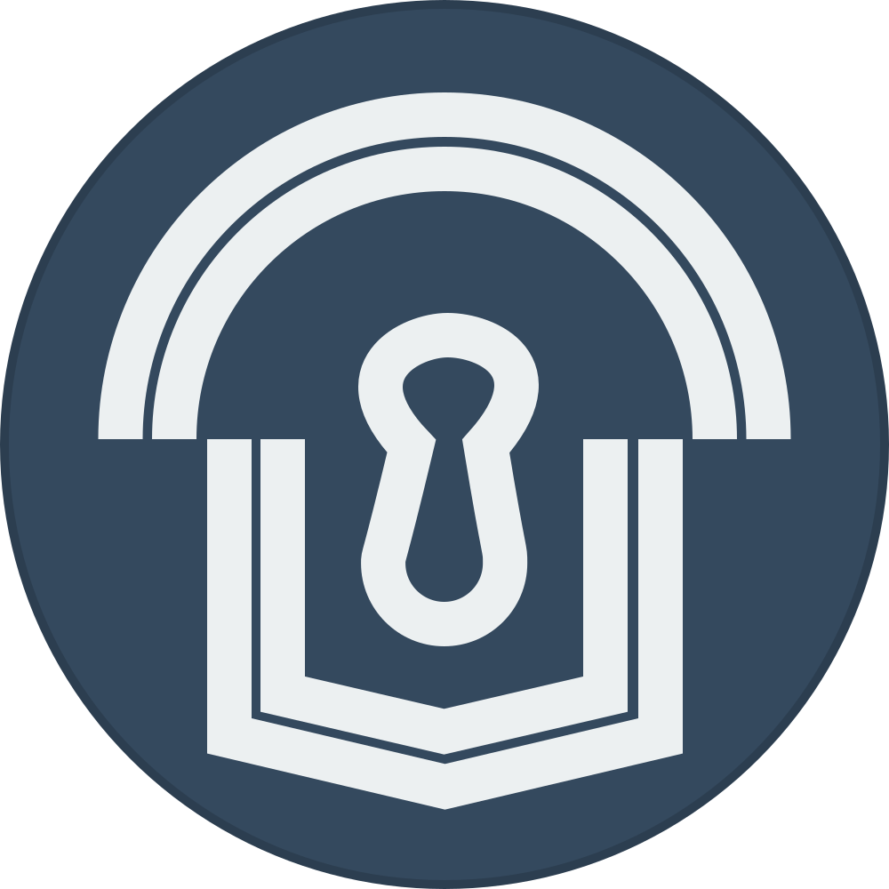

# Clubhouse Protocol



[](https://badge.fury.io/js/clubhouse-protocol) [](https://snyk.io//test/github/clubhouse-protocol/protocol?targetFile=package.json) [](https://travis-ci.org/clubhouse-protocol/protocol) [](https://codeclimate.com/github/clubhouse-protocol/protocol/maintainability) [](https://codeclimate.com/github/clubhouse-protocol/protocol/test_coverage) [](https://wallabyjs.com)  [](https://sonarcloud.io/dashboard?id=clubhouse-protocol_protocol)

**IMPORTANT**: This is a _crypto-protocol_ created by a **non-security-expert**, which means that you should NOT use this for anything that requires actual security.

Hopefully I can someday get someone with more knowledge than me to review the project and say if it is secure (most likely not), if it can be made secure (hopefully) or it is just an awful idea all in all (quite possible)

## Description

An OpenPGP based crypto group chat with decentralized rule managment

## Installing

```npm install --save clubhouse-protocol```

## Usage

Documentation is still being written... but there is an [interactive tutorial](https://clubhouse-protocol.github.io/tutorial/)
